# faber-smoke-hood-esp32
IR esp32 smoke hood with HomeAssistant and ESPHome

Remote Original control (update at 6/12/2024): https://www.faberspa.com/products/accessorio-telecomando-faber-air-hub-bt-ir

Thanks to Tomasinjo for code IR: https://github.com/Tomasinjo/hob2hood-faber
And regypt: https://www.reddit.com/r/homeassistant/comments/kgubve/anyone_know_ir_codes_for_this_he_range_hood/

There are so many remote controls and brands, I have listed and found some for everyone

In the manuals and photos section I have inserted some images and pdfs with the manuals that I found online
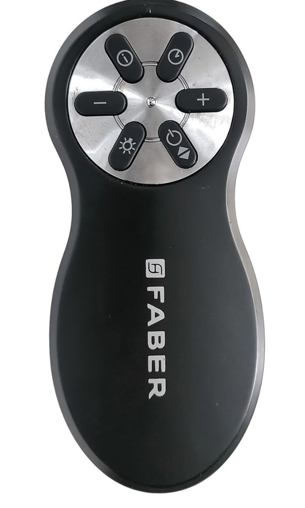 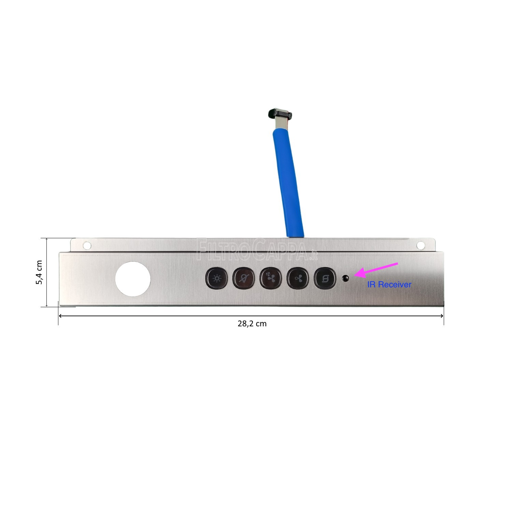

# Remote code:

**Faber** **Mepamsa**
112.0157.354
112.0540.798
133.0180.074
133.0548.417
133.0546.169
133.0546.169
133.0676.796

**GE**
UXRC70
JXRC70

**AEG**
4055452389

**SMEG**
RCKF2

**SIEMENS**
LZ75956

**Franke**
FME407XS
110.0260.618
112.0174.991

# Codici IR per la Cappa Cucina

Questo repository contiene i codici IR raccolti e organizzati per controllare una cappa cucina. I codici sono divisi per funzione, includendo sia i comandi normali che quelli per pressioni lunghe.

## Tabella dei Contenuti

- Ventola Vel -
- Ventola Vel +
- Modalità Clock
- Power
- Luce
- Ventola Turbo

---

## Codici

**Ventola Vel -:**
- Normale: `[726, -1421, 1428, -695, 727, -696, 724, -1424, 1429, -695, 727, -2816, 1428, -1423, 1428]`
- Long Press: `[727, -711, 3640, -695, 726, -714, 3640, -2130, 2883, -700, 1455]`

**Ventola Vel +:**
- Normale: `[727, -703, 2182, -698, 722, -722, 699, -705, 2182, -694, 726, -2124, 2154, -1423, 1427]`
- Long Press: `[728, -708, 2908, -696, 725, -1433, 2883, -1417, 699, -709, 2910]`

**Modalità Clock:**
- Normale: `[727, -1420, 1428, -1417, 699, -2120, 1427, -2114, 701, -1422, 1427]`
- Long Press: `[1466, -1418, 699, -699, 1455, -695, 728, -1416, 700, -693, 727, -701, 1453, -1417, 700, -694, 727]`

**Power:**
- Normale: `[727, -694, 726, -1421, 1428, -693, 728, -696, 725, -1423, 1427, -2114, 700, -1417, 700, -700, 1454]`
- Long Press: `[726, -693, 726, -1417, 700, -694, 727, -1418, 699, -1417, 700, -1417, 702, -692, 727, -1417, 700]`

**Luce:**
- Normale: `[728, -692, 727, -699, 1454, -1417, 701, -695, 726, -699, 1455, -2809, 699, -695, 726, -705, 2181]`
- Long Press: `[727, -692, 727, -694, 726, -700, 1455, -1418, 699, -696, 726, -694, 727, -695, 726, -695, 726, -695, 726, -696, 725]`

**Ventola Turbo:**
- Normale: `[727, -698, 1455, -1417, 700, -695, 725, -701, 1455, -1417, 700, -2119, 1427, -2119, 1427]`
- Long Press: `[728, -703, 2183, -1417, 700, -1427, 2156, -2113, 700, -705, 2182]`

# My Project
Per la mia FABER Ho utilizzato un esp32-c3 perchè mi serviva qualcosa di piccolo, inizialmente pensavo di tenerlo direttamente dentro la tastiera, ma ho pensato che poi i vapori della cucina avrebbero potuto rompere il mio esp, 
alla fine ho fatto un piccolo foro e fatto passare i fili dentro il vano del mobile.
Dobbiam dotarci di un IR Transmitter.
Ho creato un foro nella tastiera, e tirato i tre fili che mi servivano per comandare il transmitter, e l'esp l'ho collegato all'alimentazione della cappa.

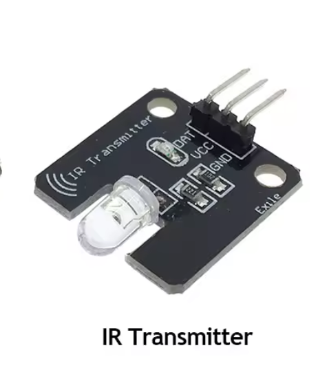 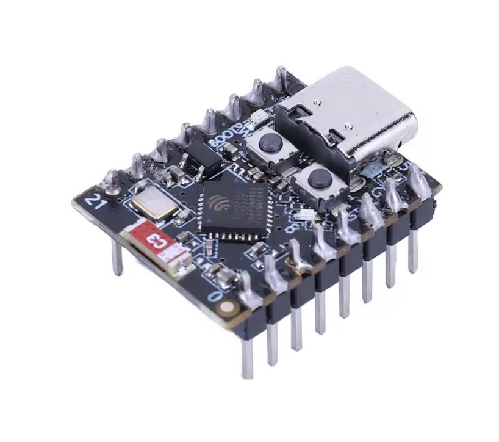

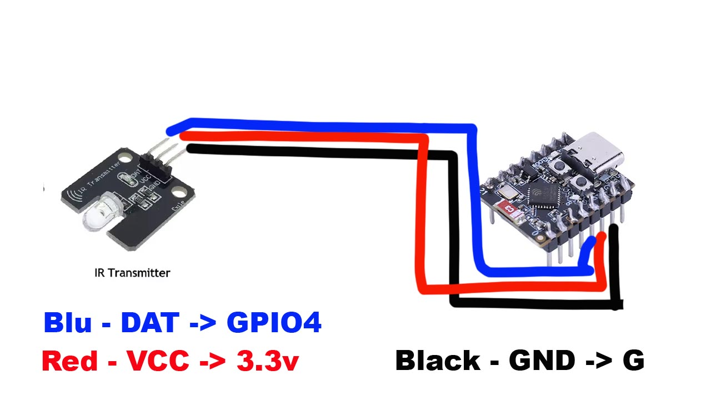 

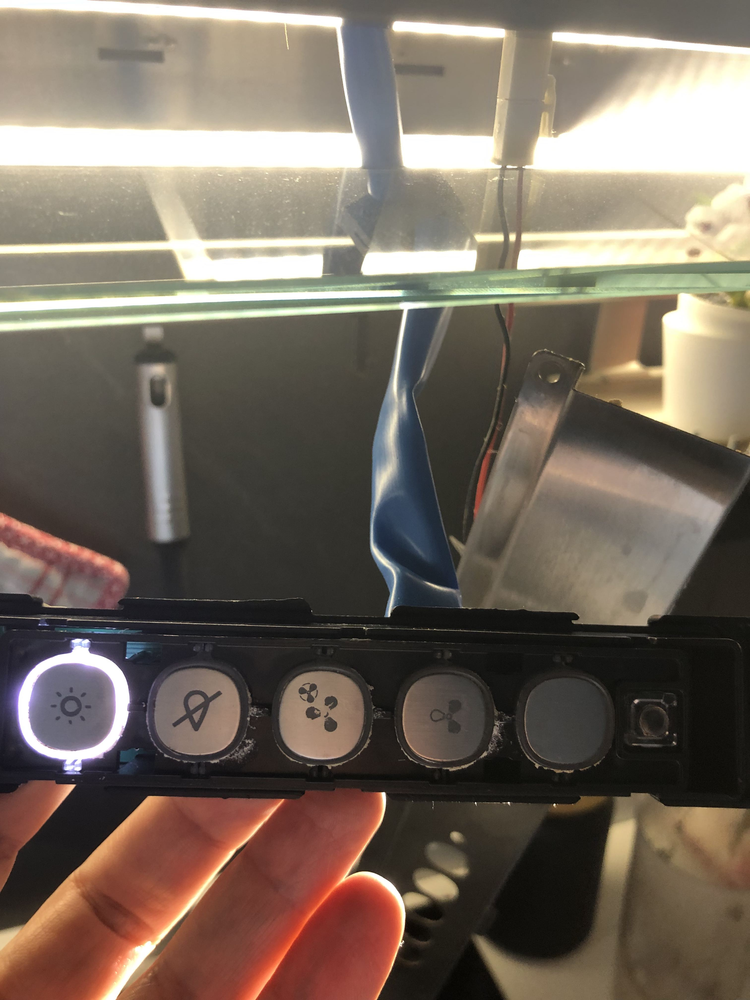 

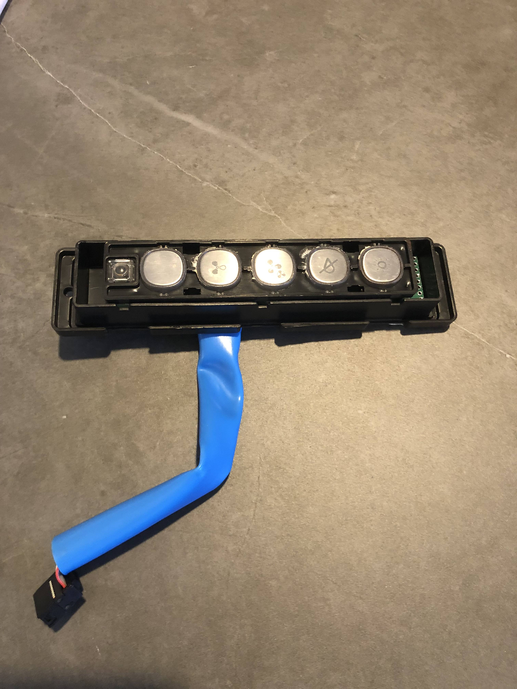 
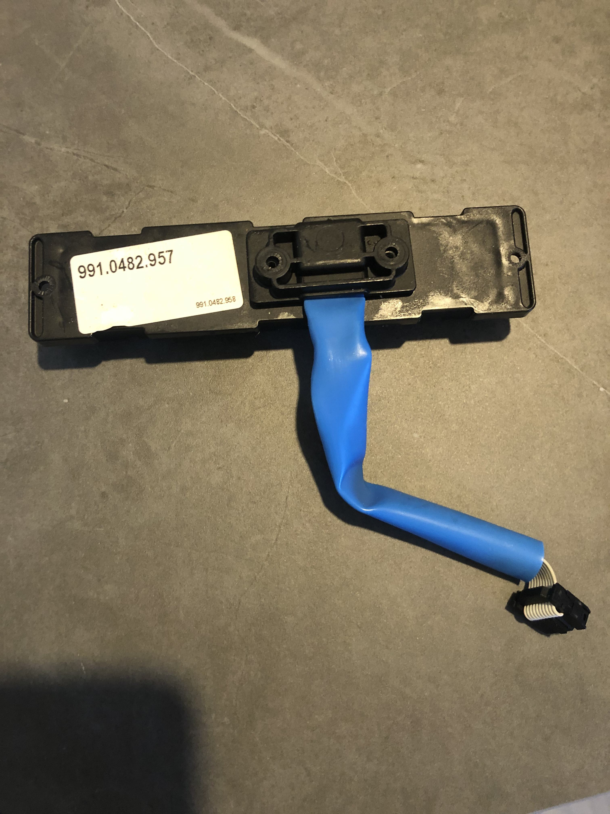 
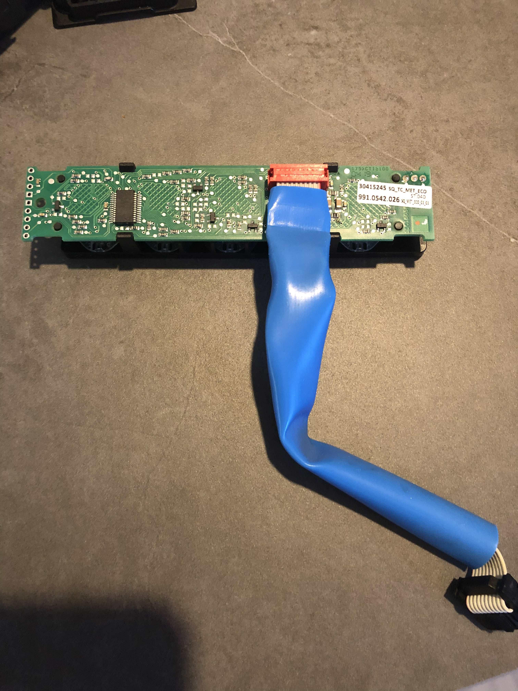 
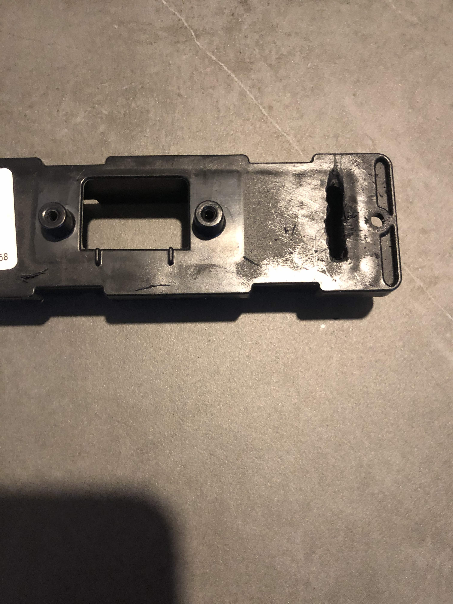 
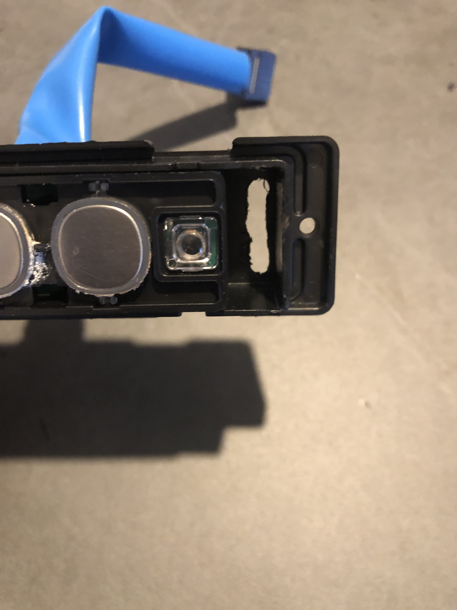 
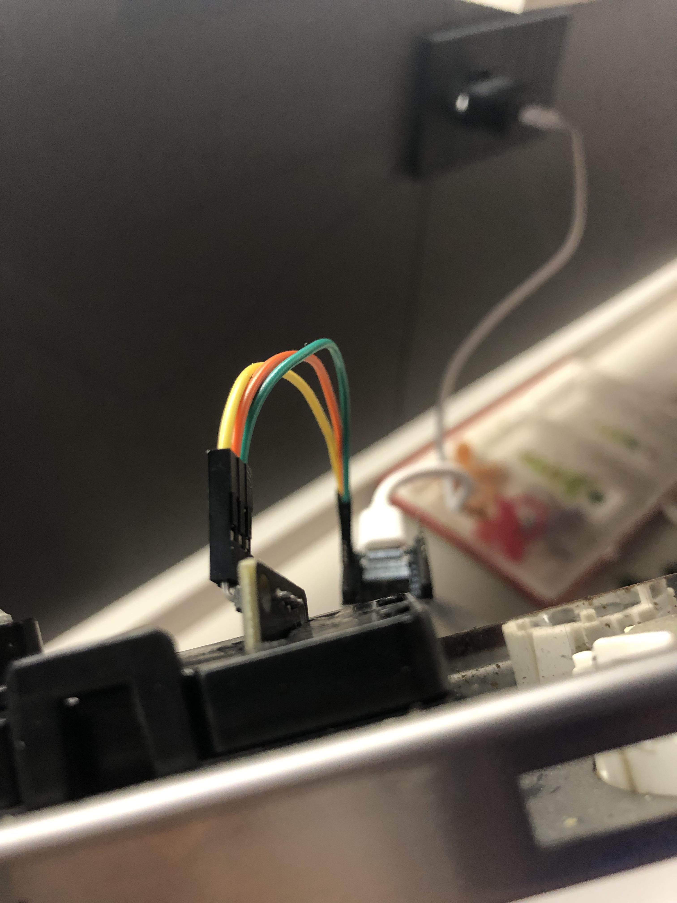 
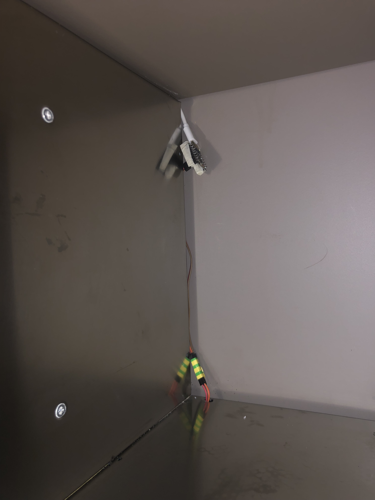
